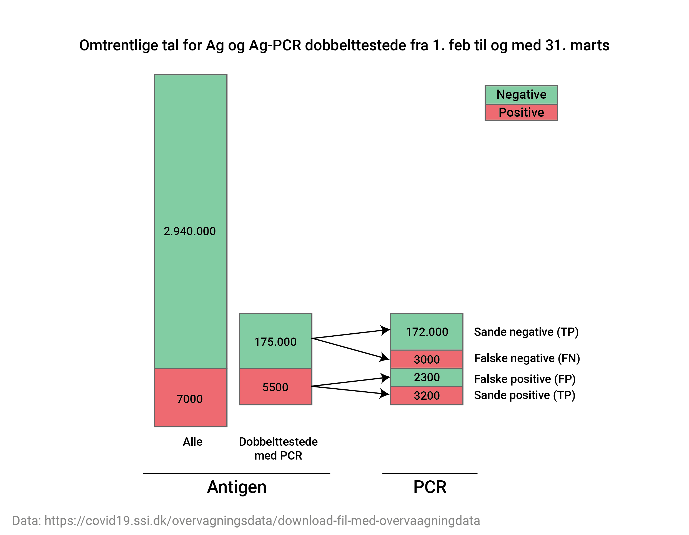

```{r setup, include=FALSE}
knitr::opts_chunk$set(echo = TRUE)
```

## 




#### Der er fire relevante begreber:

- Falsk-positivrate: Chancen for at en ikke-smittet tester positiv

$$FPR = \frac{FP}{FP + TN}$$

- Falsk-negativrate: Chancen for at en smittet tester negativ 

$$FNR = \frac{FN}{FN + TP}$$

- Falsk-opdagelsesrate (*False discovery rate*): Chancen for at en positivt-testet ikke er smittet

$$FDR = 1 - \frac{TP}{TP + FP}$$

- Falsk-udeladelsesrate (*False omission rate*): Chancen for at en negativt-testet er smittet

$$FOR = 1 - \frac{TN}{TN + FN}$$

#### Beregning baseret på dobbelttestede
Lad os indsætte tallene fra SSI's datasæt. I første omgang bruger vi kun tallene for de personer der er testet både med Ag og PCR.

$$FPR = \frac{2300}{2300 + 172000} = 1.3\%$$
$$FNR = \frac{3000}{3000 + 3200} = 48\%$$
$$FDR = 1 - \frac{3200}{5500} = 42\%$$
$$FOR = 1 - \frac{172000}{175000} = 1.7\%$$

Men hvordan ville disse tal se ud hvis alle Ag testede blev dobbelttestet med PCR? 

Blandt Ag-positive er knap 80% også PCR testet og de dobbelttestede kan derfor med rimelighed anses som repræsentative for alle Ag-positive. Hvis alle Ag-positive var blevet PCR testet antager jeg derfor at der var fundet 7000/5000 * 2300 = ca. 3000 falsk positive, og 7000/5500 * 3200 = ca. 4000 sande positive. 


For Ag-negative er det ikke så simpelt da kun 6% også er PCR testet og man kan derfor ikke antage at de er repræsentative for alle Ag-testede, men vi kan beregne tal for to hypotetiske yderpunkter:

1) De dobbelttestede er repræsentative for alle Ag negative.
2) Alle personer med falske negative Ag-svar blev fanget ved dobbelttestning, så vi finder ikke flere ved at PCR-tjekke flere Ag negative. 

#### Beregning for yderpunkt 1:

Først beregnes en opskaleringsfaktor:

- for Ag-negative: 2940000 / 175000 = 16.8


$$FPR = \frac{3000}{3000 + 172000* 16.8} = 0.1\%$$

$$FNR = \frac{3000* 16.8}{3000* 16.8 + 4000} = 93\%$$

$$FDR = 1 - \frac{4000}{7000} = 43\%$$

$$FOR = 1 - \frac{172000*16.8}{175000*16.8} = 1.7\%$$

#### Beregning for yderpunkt 2:

$$FPR = \frac{3000}{3000  + 2940000 - 3000} = 0.1\%$$


$$FNR = \frac{3000}{3000 + 4000} = 43\%$$

$$FDR = 1 - \frac{4000}{7000} = 43\%$$

$$FOR = 1 - \frac{2940000-3000}{2940000} = 0.1\%$$

Baseret på disse beregninger vil jeg her komme med min vurdering: 

- Falsk-positivrate ligger formentlig omkring 0.1%, og chancen for at være PCR negativ på trods af en positiv Ag test ligger i den angivne 2 mdrs periode formentlig omkring 40%.
- Falsk-negativrate er mere usikker men 40-60% er måske ikke helt galt. Chancen for at være PCR positiv på trods af en negativ Ag test ligger nok under 0.2% (idet jeg antager at den vil være lavere end den generelle PCR positivprocent).

